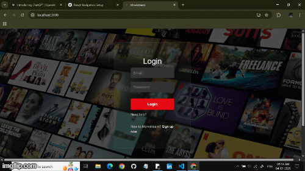

# 🎬 Movistream – OTT Streaming Web Application

Movistream is a full-stack OTT web application that brings together the best of Netflix and Hotstar-style streaming UIs. It offers categorized browsing, trailer previews, watchlists, full-screen video playback, and a sleek responsive experience tailored for binge-watchers and media lovers.

---

## 🌐 Live Demo  
👉 [Visit Movistream](https://movistream-f.vercel.app/)

---

## 📸 Screenshots  


---

## ✨ Features

🎞️ **Poster-Based Categories**  
Browse movies, TV shows, anime, and web series via Hotstar-style vertical poster cards.

🎬 **Autoplay Trailer Previews**  
Hover-based YouTube trailer playback (ReactPlayer) with fullscreen, mute, and info.

👀 **Detailed Popups**  
Click on a poster to view movie details, director, genre, year, language, rating, and cast photos.

🔐 **JWT Authentication (Planned)**  
Secure login system using JSON Web Tokens and protected routes.

🛒 **Watchlist (Planned)**  
Add or remove content from personal watchlist (coming soon).

⏭️ **Advanced Watch Page**  
Includes:
- Skip Intro
- Next Episode
- Title & Episode Overlay
- Auto-exit Fullscreen on Back

📱 **Mobile-Responsive UI**  
Optimized for smartphones, tablets, and desktops.

---

## 🛠️ Tech Stack

### 🔹 Frontend
- React.js
- React Router DOM
- Axios
- Bootstrap / Tailwind CSS
- ReactPlayer
- HTML5 + CSS3

### 🔸 Backend
- Java 17+
- Spring Boot
- Spring Data JPA
- RESTful APIs
- MySQL / PostgreSQL

### ☁️ Deployment
- Frontend: [Vercel]()
- Backend: [Render]() (Dockerized)

---

## 📁 Project Structure
```bash
movistream/
├── frontend/ # React App
│ ├── components/ # Cards, Navbar, Player
│ ├── pages/ # Home, Details, WatchPage
│ └── App.jsx # Routing Setup
├── backend/ # Spring Boot Project
│ ├── controller/
│ ├── service/
│ ├── model/
│ ├── repository/
│ └── application.properties
└── README.md
---
```

## 📂 Installation & Setup

### 🔃 Clone the Repository
```bash
git clone https://github.com/your-username/movistream.git
cd movistream

```


1️⃣ Frontend Setup
```bash
cd frontend
npm install
npm start
```
2️⃣ Backend Setup
```bash
cd backend
./mvnw spring-boot:run
```

⚠️ Make sure to configure your MongoDB URI and Cloudinary credentials in application.properties.

---
## 🔐 Environment Variables
Create a .env file in both client and server folders:

Backend application.properties
```bash
spring.datasource.url=jdbc:mysql://localhost:3306/movistream
spring.datasource.username=your_username
spring.datasource.password=your_password
```
---

🤝 Contributing
---
Pull requests are welcome!
If you’d like to contribute:

- Fork the repo
- Create your feature branch: git checkout -b feature/YourFeature
- Commit your changes
- Push to the branch
- Open a pull request

## 📄 License
This project is licensed under the MIT License.
---

👨‍💻 Developer
---
Tamil Kumaran
🚀 Passionate Full-Stack Developer
📧 Reach me at: [LinkedIn](www.linkedin.com/in/tamilkumaran-b-800939298)• [Email](tamilkumaranwork@gmail.com)
